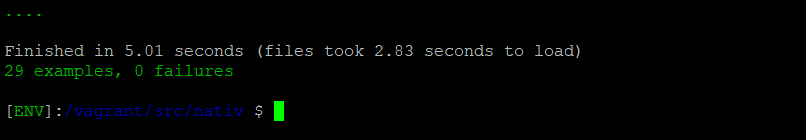

Within Rails 5.2.3 and Ruby 2.5.3, Rspec tests can by run using the command    bundle exec rspec 

Here, I wrote 29 passing tests for the users, places, comments, and reviews controllers. As our application at this point was breaking, these tests helped get our code and app to a functioning state.  
